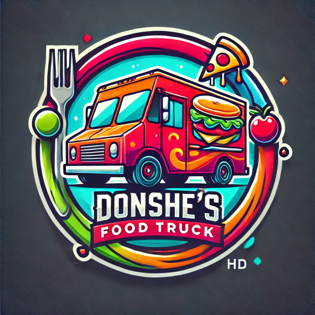

# <h1 align = "center" > Donshe's Food Truck </h1>

    
    

### Module 2 Challenge: Python Challenge 
#### This assignment involved designing an interactive ordering system for a food truck. 
#### This program outlines the steps to manage and validate user inputs, then store the customer's orders  
#### and prints a formatted receipt with the total price of all items ordered.

Having imported the menu dictionary from another file, I have adapted the menu for Donshe's Food Truck.
The take_order function  begins by greeting the customer, printing the sub-menu, and the customer is prompted to enter the item number from the menu. 
This selection is saved as a variable called menu_selection.

Input validation was added to make sure menu_selection is numerical and converts the input to an integer, else an error message will display.
Validation also checks to make sure the item entered is the keys of menu_items. Another error message displays, otherwise, the following actions are taken:

* Get the item name from the menu_items dictionary and store it as a variable named item_choice 
* Ask the customer how many item_choice they wish to purchase, and advise the quantity will default to 1 if an invalid input is entered. 
    This input is saved as a variable called quantity_input, which is validated, converted to an integer and stored as quantity.
* The item is appended to the order list, and a message is displayed showing how manny items were added.
The customer is then asked if they wish to order from another category? 
    If yes, the order continues. 
    If no, a receipt is printed showing an itemized list of items ordered, each item's price, and the Grand total. 
Item name                 | Price  | Quantity
--------------------------|--------|----------
Apple                     | $0.49  | 1
Tea - Thai iced           | $3.99  | 2
Fried banana              | $4.49  | 3
                                                                                                                             
